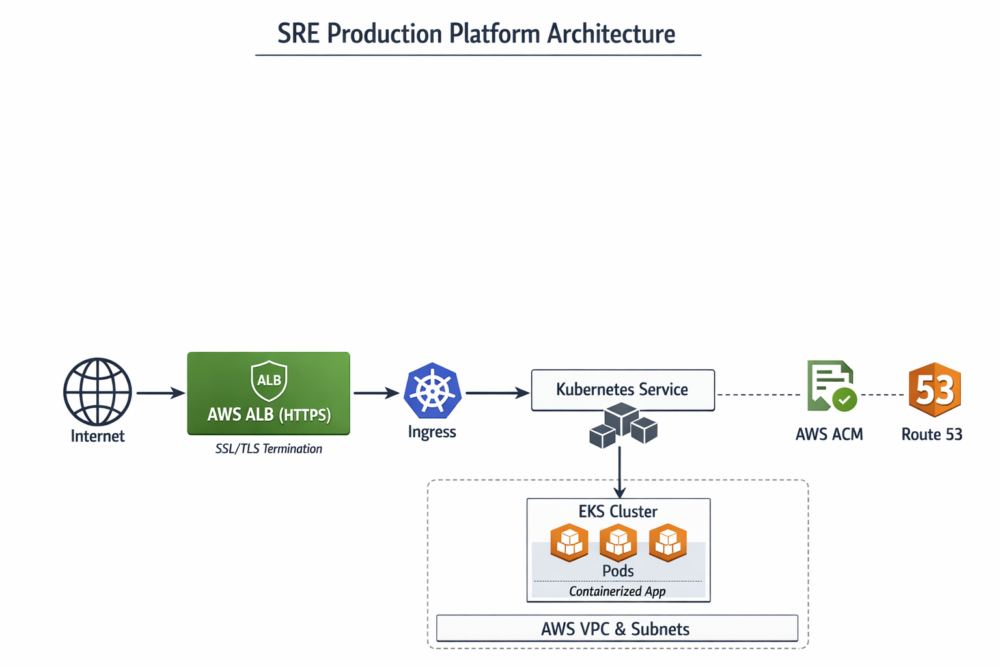

# SRE Production Platform

## Overview
This project demonstrates the design and operation of a **production-grade SRE platform** built with modern DevOps and Site Reliability Engineering practices.

The goal is not to build a feature-rich application, but to show how to:
- Provision infrastructure reliably
- Deploy safely with CI/CD
- Observe systems using meaningful signals
- Define and enforce SLOs
- Respond to and learn from failures

## Architecture

**High-level components:**
- AWS cloud infrastructure (provisioned via Terraform)
- Containerized Python service
- Kubernetes orchestration
- Automated CI/CD pipeline
- Centralized logging, metrics, and alerting
- SLO-based reliability management

## Project Goals
- Infrastructure as Code (no manual cloud setup)
- Zero-click deployments
- SLO-driven alerting (not resource noise)
- Fast recovery from failure (low MTTR)
- Cost-aware scaling

## Non-Goals
- No complex business logic
- No UI-heavy frontend
- No vendor-specific lock-in beyond AWS primitives

## Repository Structure
- terraform/ # Infrastructure as Code
- app/ # Python service
- k8s/ # Kubernetes manifests
- ci/ # CI/CD pipelines
- observability/ # Dashboards and alerts
- chaos/ # Failure injection experiments
- tools/ # SRE automation tooling
- postmortems/ # Incident reports
- diagrams/ # Architecture diagrams

## Current Status
🚧 Project under active development

## Planned Features
- Highly available Kubernetes deployment
- CI/CD with automated rollback
- Prometheus/Grafana observability
- SLOs with error budgets
- Chaos testing and postmortems
- Python tooling for reliability reporting

## How to Run (Coming Soon)
Deployment instructions will be added as infrastructure and CI/CD are completed.
